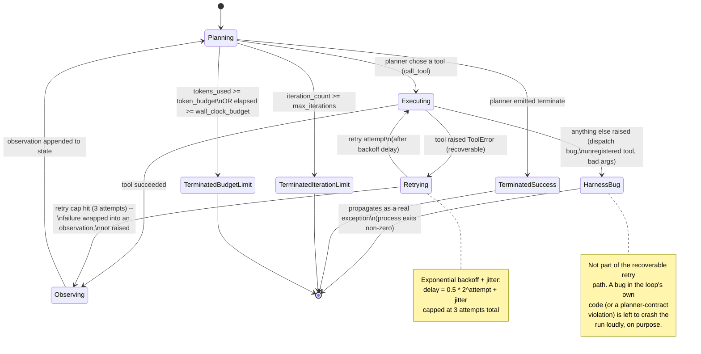

# FDE Xlerate - Week 1, Day 2
Assignment artifact: state-machine diagram of the agent + its failure modes

## Diagram

## Reading the diagram

- **The ring** is `Planning -> Executing -> Observing -> Planning`. Every
  framework encountered later in the program is a different way of drawing
  this same ring.
- **Two legitimate exits**, both checked at the top of every iteration in
  `Planning`: the planner emits `terminate` (`TerminatedSuccess`), or a
  limit is hit (`TerminatedIterationLimit` / `TerminatedBudgetLimit`). This
  is what makes it provable the loop cannot run forever — the check runs
  *before* the planner is even called, independent of what the planner or
  any tool does.
- **The retry sub-loop** (`Executing <-> Retrying`) is entirely contained
  within a single tool call. It never touches `iteration_count` — a flaky
  tool retried 3 times inside one turn still only counts as one iteration
  of the outer loop.
- **The escape hatch** (`Executing -> HarnessBug`) is the one path that
  does *not* feed back into `Planning`. A `ToolError` is recoverable and
  stays inside the ring; anything else (an unregistered tool name, a
  planner response that fails contract validation, a bad tool signature)
  is treated as a bug in the harness itself and is allowed to crash the
  run rather than being silently absorbed.

## Observed failure modes (from actual runs — see `../runs/`)

| Run | What happened | Diagram path taken |
|---|---|---|
| `clm-1001_clean.json` | `check_repair_shop_reputation` failed 3x, retried with backoff, capped, planner reasoned around it and approved anyway | `Executing -> Retrying -> Retrying -> Observing -> Planning -> TerminatedSuccess` |
| `clm-1042_suspicious.json` | Same tool failure, but this time combined with a weather contradiction the planner used to deny the claim | same path, different terminal decision |
| `forced_failure.json` (scripted, deterministic) | Same tool forced on turn 1, escalate on turn 2 — proves the mechanism independent of what the live model chooses to call | `Executing -> Retrying -> Retrying -> Observing -> Planning -> TerminatedSuccess` |
