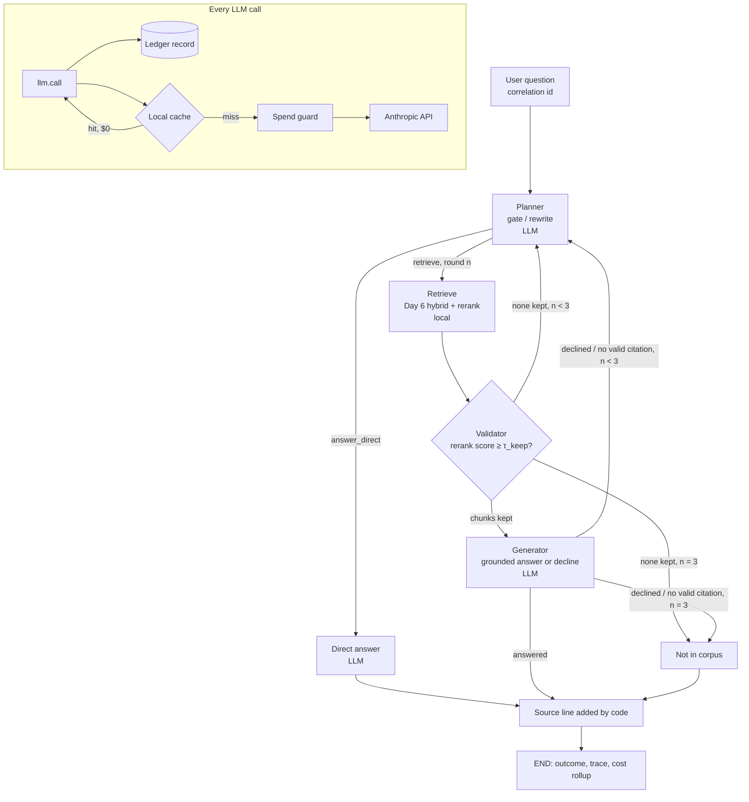

# FDE Xlerate - Week 2, Day 2
Spec: agentic RAG with per-call cost/latency instrumentation, and a three-model comparison (Harbor Credit Union)

## Business problem

Day 1 (Day 6 of the course) gave Harbor a measured retrieval path: hybrid
search over its policy, fee and procedure documents, reaching R@5 = 0.902
with every access filter holding. Two things are still missing.

First, **nothing answers the question yet**. Day 6 stopped at "top-k
chunks with citations". Also, static RAG retrieves on every question,
whether or not retrieval helps ("hi", "what can you do?"). It also
summarises whatever comes back, even when the top-k is irrelevant. Day 6
showed that a relevance cut-off alone can't spot an unanswerable question:
q045 (RV loan prepayment penalty) scored higher than 12 answerable queries.

Second, **nobody can say what one member question costs**. A client
finance review asks "what does one interaction cost, and how long does it
take?". An FDE who improves quality without being able to answer that
hasn't finished the job. Agentic RAG makes the question harder: the cost
per question now varies with how many retrieval rounds and rewrites the
agent chooses to do.

Today builds both halves:
- an agent that decides whether to retrieve, checks what it got,
  rewrites its query when retrieval is poor, and says "not in the corpus"
  rather than guessing;
- an instrumentation layer that can put a cost and a latency on every
  question.

Full lab text: `../../training_instructions/week2_day2.md`.

## Goal

1. An **agentic RAG path** (LangGraph). Every question shows in the log
   the gate decision and its reason, each retrieval round, each validator
   verdict and any query rewrite.
2. A **single instrumentation wrapper** around every LLM call. It records
   model, input/output tokens, latency, cost and purpose. Every call
   carries a per-question correlation ID so that costs roll up per
   interaction.
3. An **exact-match local cache** between the wrapper and the provider,
   with its hit rate reported and a written definition of "safely
   equivalent" for Harbor's data.
4. A **three-model comparison**: the same task and eval set run through
   Haiku 4.5, Sonnet 5 and Opus 5, with quality, cost and latency reported
   side by side. Opus 5 is the reasoning candidate, run with an explicit
   thinking budget.
5. A **written adaptation decision** for the retrieval gate: prompt, RAG or
   fine-tune/distil, each costed, with what would change the verdict.
6. The day's write-ups: the **cost/latency comparison report** (assignment
   artifact) and a 5-8 slide **high-level deck**.

## Requirements

Restated from the lab instructions. The acceptance criteria at the end
map to these one to one.

- **R1 Retrieval gate.** The agent can answer without retrieving. The eval
  set includes questions where retrieving is the wrong move. The gate
  decision and its reason are logged on every turn.
- **R2 Rewrite and retry, bounded.** On a poor retrieval the agent
  rewrites its query and retries, with a hard cap on rounds. It can
  conclude "not in the corpus" instead of looping or answering without
  grounding.
- **R3 Relevance validation.** Retrieved results are checked for
  relevance before use, so an irrelevant top-k is detected and acted on
  rather than confidently summarised.
- **R4 One instrumentation wrapper, no bypass.** Every LLM call goes
  through one wrapper that records model, input and output tokens,
  latency, cost and purpose.
- **R5 Per-interaction cost, and a cache.** Cost rolls up per question
  under one correlation ID. A cache sits in front of the provider, its hit
  rate is reported, and the rule for "safely equivalent" is written down.
- **R6 Three-model comparison.** Same task, same eval set, three models,
  with quality, cost and latency side by side.
- **R7 Reasoning model and adaptation decision.** One candidate is a
  reasoning model with an explicit thinking budget. One narrow call (the
  gate) carries a written adaptation decision.
- **D1-D4 Deliverables.** A visible agentic RAG trace; a per-interaction
  cost/latency record with cache hit rate over the full eval set; the
  comparison report; the deck.

## Decisions already made (planning session, 2026-09-25)

| # | Decision | Choice |
|---|---|---|
| 1 | Where the code lives | New `labs/week2_day2/`. It **imports** Day 6's retrieval code and index (read-only, no copy) |
| 2 | Orchestration | LangGraph low-level `StateGraph` with hand-written nodes, the same pattern as week 1 days 3-4 |
| 3 | Gate design | A dedicated LLM call returning structured `{decision, reason, search_query}` (not tool use) |
| 4 | Relevance validation | Cross-encoder reranker score against a threshold. Max **3 retrieval rounds** per turn. At the cap, answer "not in the corpus", never guess. The generator can also decline (see "Validator"). |
| 5 | Eval additions | **10 new questions where retrieving is the wrong move** |
| 6 | Answer grading | **Both**: deterministic checks + an LLM judge |
| 7 | Thinking budget | **Effort level**, stated clearly in the report (`budget_tokens` is rejected by current models) |
| 8 | Cache | **Exact-match local cache** |
| 9 | Instrumentation enforcement | See "Instrumentation rules (decision record)" |
| 10 | Adaptation decision | Written for the **gate**. Verdict: **prompt, for now** |
| 11 | Spend limit | **$4.00** of API spend for the whole day, development included |
| 12 | A generator decline | Counts as a **failed validation**: back to the planner for a rewrite while rounds remain, `not_in_corpus` only at round 3. See "Decision record: 12-14". |
| 13 | Naming the source | The member-facing reply always ends with a **source line added by code**, not by the prompt: document title, version and effective date for answers; "general information, not from Harbor's documents" for direct answers. See "Decision record: 12-14". |
| 14 | Quoting the version in force | New deterministic check on q028-q031: the member-facing reply names the in-force Overdraft Policy version (3.0) and never v2. The judge is unchanged. See "Decision record: 12-14". |
| 15 | Judge prompt | **judge_v2** after calibration: an explicit order of checks (contradiction → omission → correct); extra detail never lowers the verdict. All reported runs re-graded; v1 grades kept. Calibrated first by an independent model grader (24/30 → 29/30), then by a **human reviewer**: v2 matches the human on correct vs not correct (29/30), but not on partial vs incorrect (25/30). See findings log, milestone 10. |

### Decision record: 12-14 (review of the prompts against the lab text, 2026-09-25)

The lab text and the week's Harbor constraints were checked against four
open questions about the prompts. None was answered outright. These three
decisions follow from what the text does say. No prompt had been run
yet, so nothing here was tuned against results.

**Decision 12: a generator decline triggers a rewrite, not an immediate stop.**
- *What the lab says:* results "return through a validator that scores
  relevance and yields either usable context or a signal to rewrite, and
  the rewrite path loops back to the planner under a bounded counter". An
  irrelevant top-k must be "detected **and acted on**".
- *The problem with the first design:* when the generator declined a
  near miss (q045: RV loan vs auto loan), the question ended at once, even
  with rounds left. That skips the rewrite the lab's architecture calls
  for.
- *Decision:* the generator's coverage check is the second layer of
  validation. Both a decline (`status: "not_in_corpus"`) and a blocked
  ungrounded answer count as a failed round:
  - round < 3: back to the planner in rewrite mode. The rewrite prompt is
    told *why* the round failed, including the generator's reason (e.g.
    "evidence covers auto loans, not RV loans");
  - round = 3: `not_in_corpus`.
- *Cost:* a question that keeps failing can now cost up to 1 gate + 2
  rewrites + **3** generate calls, instead of 1. This only happens on
  near misses and unanswerable questions (q043-q045, q003). It stays
  bounded by `MAX_ROUNDS`. The pilot includes q045, so the budget
  projection covers it.
- *Rejected alternative:* stopping at the first decline. It's cheaper,
  but it doesn't match the lab's "detected and acted on", and it gives a
  near miss no chance to find the right passage with a better query.

**Decision 13: the source line is added by code, for every reply.**
- *What applies:* the week's Harbor constraint "every answer names the
  source it came from". This applies to direct answers too, which
  originally named no source at all.
- *Decision:* code appends one source line to every member-facing reply:
  - answered: `Source: <title> (version <v>, effective <date>), p.<n>, <section>`,
    one per cited document, from the chunk metadata (the same fields as
    Day 6's `Result.citation()`);
  - answered_direct: `Source: general information, not from Harbor's documents.`;
  - not_in_corpus: `Source: none found. Searched Harbor's documents (<n> rounds).`
- *Why code, not the prompt:* the same reason the citation guard is in
  code. A prompt instruction is followed most of the time; code is
  followed every time. The metadata is exact, whereas a model can
  misquote a title or version. The prompts are therefore unchanged.
  Generator rule 3 still asks for the version in prose too.
- *How it's checked:* a unit test asserts that every outcome type
  carries a source line. The grader counts replies without one; this
  should always be 0.

**Decision 14: a deterministic "version in force quoted" check.**
- *What applies:* "Policy answers quote the policy version in force."
  The golden `answer` fields contain no versions (q028: "$29 per
  item."), so the judge can't check this. The existing version check
  only confirms that a v3 chunk was *cited*.
- *Decision:* for q028-q031, a new check `version_quoted` passes when
  the member-facing reply (answer + source line) names version 3.0
  (`3.0`, `v3`, `version 3`) and nowhere names version 2. The judge
  prompt is unchanged.
- *Caveat:* the source line (decision 13) names the version whenever a
  v3 chunk is cited. So `version_quoted` mostly re-confirms the citation
  check. That's legitimate, since the member does see the version. So
  the report doesn't overstate the model, a second, informational number
  `version_in_prose` records whether the *model's own prose* named the
  version (from generator rule 3).

## Harbor constraints that apply today

| Harbor constraint | What it forces today |
|---|---|
| Every answer names the source it came from | A generated answer must cite at least one of the chunk IDs it was given. An "answered" result with no valid citation is blocked in code and counts as a failed round (decision 12). Every reply, direct answers included, ends with a source line added by code (decision 13). |
| Policy answers quote the policy version in force | The superseded filter from Day 6 stays on. The generator prompt asks for the version in its prose. The code-added source line carries the document version and effective date (decision 13). q028-q031 are checked for the in-force version (decision 14). |
| Memory holds only what the member said this conversation | Each eval question is its own single-turn conversation. Nothing is carried between questions. The cache is **not** memory: see "Cache" for why a cached answer is safe to reuse. |
| Aggregate questions go through the governed SQL view | Still out of scope (later this week). |
| Data leaving Harbor's environment | Today every question and every retrieved chunk goes to the Claude API. This is new compared with Day 6, where only one public chart crop did. Retrieved chunks are already PII-scrubbed (Day 6 R4). Restricted documents are never retrieved for member-facing runs. The report notes this as a governance item. |

## Scope and non-goals

**In scope:** everything under Goal.

**Not in scope today:**
- Multi-turn conversation. Every question is single-turn, so a "rephrase
  what you just said" style question can't be tested today and isn't in
  the 10 new questions.
- Changing the index, the chunker or the retrieval code. Day 6 is used
  **as-is**. If a Day 6 bug turns up, it is recorded in the findings log,
  not fixed here.
- Semantic caching (decided against; see "Cache").
- The router across vector / graph / SQL / MCP (later this week).
- Tuning prompts or thresholds until the numbers go up. Each parameter is
  chosen up front. Any change is a named experiment in the report, as on
  Day 6.

## Key concepts (short primer)

- **Static vs agentic RAG.** Static: every question → retrieve → answer.
  Agentic: the model decides *whether* to retrieve, *what* to search for,
  and whether the results are good enough, and it can retry.
- **Gate.** The first decision in the loop: "does answering this need
  Harbor's documents?". "Hi" doesn't. "What's the wire fee?" does.
- **Validator.** A check between retrieval and answering: "are these
  chunks actually about the question?". Without one, the agent summarises
  an irrelevant top-k as if it were evidence.
- **Query rewrite.** When retrieval is poor, the agent writes a better
  search query (for example "send money to another bank" → "outgoing
  domestic wire transfer fee") and tries again.
- **Bounded loop.** A hard cap on rounds, enforced in code, not in the
  prompt. Without one, cost per question has no upper limit.
- **Correlation ID.** One ID for one user question, stamped on every LLM
  call and retrieval round it causes, so they can be summed.
- **Tokens and cost.** Providers bill per million input tokens and per
  million output tokens, at different rates per model. **Thinking tokens
  are billed as output tokens.** Cost of a call = input × input rate +
  output × output rate (+ cache terms, below).
- **Two kinds of cache.**
  - A *local* cache (ours) stores a previous response and returns it
    without calling the provider. That call costs $0.
  - Anthropic's *prompt caching* stores a prompt *prefix* on the
    provider side. Reading it is billed at a reduced rate (about 0.1× the
    input rate), not free. Writing it costs about 1.25× the input rate.
- **Effort.** On current Claude models, how much the model thinks is set
  with `output_config.effort` (`low` / `medium` / `high` / `xhigh` /
  `max`). The fixed token budget (`budget_tokens`) that older models used
  is **rejected with a 400** on Sonnet 5 and Opus 5.
- **LLM-as-judge.** A second model grades an answer against the expected
  answer. It's cheaper than hand-grading, but it has to be spot-checked by
  hand, because a judge can be wrong too.

## Architecture

The Day 6 retrieval path becomes a **tool** the agent may call, instead
of a fixed first step. The planner (gate) sits in front of it. The
instrumentation wrapper sits around every LLM call, and the cache sits
between the wrapper and the provider.

```
                       one user question  ──▶  correlation_id = <run_id>/<query_id>
                                   │
                                   ▼
                           ┌───────────────┐  LLM: purpose=gate (round 1)
               ┌──────────▶│  planner      │       purpose=rewrite (rounds 2-3)
               │           │ gate / rewrite│  → {decision, reason, search_query}
               │           └──────┬────────┘
               │     answer_direct│         │ retrieve (round n ≤ 3)
               │                  ▼         ▼
               │        ┌──────────────┐  ┌──────────────────────────────────────────┐
               │        │ direct answer│  │ retrieve: Day 6 Retriever, hybrid_rerank │  local: embed + rerank
               │        │ (no Harbor   │  │ layout / B_structure, access filter,     │  recorded at $0
               │        │  facts)      │  │ top-5 with reranker scores               │
               │        └──────┬───────┘  └──────────────────┬───────────────────────┘
               │               │                              ▼
               │               │                   ┌────────────────────┐
               │   rewrite     │                   │ validator          │ keep chunks with
               ├───────────────┼───────────────────│ rerank ≥ τ_keep ?  │ score ≥ τ_keep
               │ (n < 3, none  │                   └───┬────────────┬───┘
               │  kept)        │           ≥1 kept     │            │ none kept and n = 3
               │               │                       ▼            ▼
               │               │             ┌──────────────┐  ┌───────────────────┐
               │   rewrite     │             │ generator    │  │ not_in_corpus     │
               └───────────────┼─────────────│ grounded     │  │ (no LLM call)     │
                 (n < 3,       │             │ answer or    │──▶ (n = 3, declined) │
                  declined /   │             │ decline      │  └─────────┬─────────┘
                  ungrounded)  │             └──────┬───────┘            │
                               ▼                    ▼ answered           ▼
                                code adds the source line (decision 13)
                                         END: outcome + trace + cost rollup

  EVERY LLM call:   node → llm.call() ──▶ [ledger record] ──▶ local cache ──hit──▶ response ($0)
                                                                   │ miss
                                                                   ▼
                                                   spend guard ──▶ Anthropic API ──▶ response
                                                                  (priced from pricing.json,
                                                                   incl. provider cache reads/writes)
```

Mermaid version for the report/deck:



## The agent (LangGraph)

Same pattern as week 1 days 3-4: low-level `StateGraph`, hand-written
nodes, prompts in versioned files under `prompts/`, no prebuilt agent.

### State

```
AgentState:
  correlation_id: str        # "<run_id>/<query_id>", set before invoke
  question: str
  tenant: str                # from the eval row; "retail" for the new questions
  allow_restricted: bool     # always False in member-facing runs
  round: int                 # retrieval rounds done so far (0-3)
  gate: dict | None          # {decision, reason, search_query} from round 1
  queries: list[str]         # every search query issued, in order
  rounds: list[dict]         # per round: {n, query, results:[{chunk_id, doc_id, rerank}], kept:[chunk_id],
                             #             verdict: "usable" | "poor" | "declined" | "ungrounded", generator_reason}
  rewrites: list[dict]       # per rewrite: {n, new_query, reason}
  kept_chunks: list[dict]    # chunks passed to the generator this round (text + metadata)
  outcome: str | None        # "answered" | "answered_direct" | "not_in_corpus"
  outcome_reason: str        # e.g. "no chunk ≥ τ_keep after 3 rounds", "generator declined in all 3 rounds: ..."
  answer: str                # the model's prose only (what the judge grades)
  source_line: str           # added by code (decision 13)
  reply: str                 # what the member sees: answer (or the fixed not-in-corpus text) + source_line
  citations: list[dict]      # {chunk_id, doc_id, title, version, effective_date, page, section}
```

### Nodes

| Node | LLM? | Does |
|---|---|---|
| `planner` | yes | **Round 0 (gate, `purpose=gate`):** returns `{decision: "retrieve" \| "answer_direct", reason, search_query}`. **After a failed round (rewrite, `purpose=rewrite`):** sees the question, every query tried so far, the titles plus scores of what came back, and *why* each round failed (low relevance, or the generator's decline reason, decision 12). Returns `{search_query, reason}`. Rewrite has no "give up" option: the cap is enforced by code, not by the model. |
| `retrieve` | no | `Retriever("layout", "B_structure").search(query, mode="hybrid_rerank", tenant, allow_restricted=False, current_only=True, top_k=5)`. Records a local timing record (embed + BM25 + vector + rerank). |
| `validate` | no | Keeps results with `rerank ≥ τ_keep`. Verdict: `usable` (≥ 1 kept) or `poor`. |
| `generate` | yes | `purpose=generate`. Grounded answer from the kept chunks only. Returns `{status: "answered" \| "not_in_corpus", answer, cited_chunk_ids, reason}`. |
| `answer_direct` | yes | `purpose=direct_answer`. Answers without documents. The prompt forbids stating any Harbor-specific fact (fee, rate, limit, policy). If the question turns out to need one, the reply says the agent can look it up. |
| `not_in_corpus` | no | Sets the outcome and a fixed reply: "I couldn't find this in Harbor's documents, so I won't guess. A colleague can help." |
| `finalise` | no | Adds the source line (decision 13) and builds `reply`. Every path goes through it before END. |

### Edges

```
START → planner
planner  --[decision=answer_direct]--> answer_direct → finalise → END
planner  --[retrieve / rewrite]------> retrieve → validate
validate --[usable]------------------> generate
validate --[poor, round < 3]---------> planner   (rewrite mode)
validate --[poor, round = 3]---------> not_in_corpus → finalise → END
generate --[answered, valid citation]---------------> finalise → END
generate --[declined / no valid citation, round < 3]--> planner   (rewrite mode, decision 12)
generate --[declined / no valid citation, round = 3]--> not_in_corpus → finalise → END
```

The cap (`MAX_ROUNDS = 3`, so at most 2 rewrites) lives in `settings.py`
and is checked in the edge functions. There are two cap tests:
- a validator that always says `poor`: exactly 3 retrieval rounds,
  1 gate call, 2 rewrite calls and 0 generate calls;
- a generator that always declines: exactly 3 rounds, 1 gate, 2 rewrites,
  3 generate calls. This is the most a question can cost.

### Trace log (R1, D1)

Every node appends events to `runs/<run_id>/trace.jsonl`, one JSON object
per line, keyed by `correlation_id`:

```
{"cid": "...", "event": "gate",     "decision": "retrieve", "reason": "asks for a Harbor fee", "search_query": "..."}
{"cid": "...", "event": "retrieve", "round": 1, "query": "...", "top": [["overdraft_policy_v3", 0.91], ...], "ms": 1480}
{"cid": "...", "event": "validate", "round": 1, "kept": 2, "verdict": "usable", "tau_keep": 0.10}
{"cid": "...", "event": "rewrite",  "round": 2, "new_query": "...", "reason": "..."}
{"cid": "...", "event": "generate", "status": "answered", "cited": ["..."]}
{"cid": "...", "event": "outcome",  "outcome": "answered", "cost_usd": 0.0041, "latency_ms": 3120}
```

`src/run_agent.py "question"` prints the same trace for one question in
readable form. That's the D1 demo.

## Validator (decision 4, and why the generator can also decline)

**Rule:** a chunk is *usable* if its cross-encoder rerank score is
≥ `τ_keep`. At least one usable chunk → go to the generator with the
usable chunks (max 5). None → rewrite (or not_in_corpus at round 3).

**Why this alone isn't enough.** Day 6's report (section 7) showed that no
score threshold separates answerable from unanswerable questions. q045
("prepayment penalty on an RV loan") scores 0.549, because the auto loan
sheet says "no prepayment penalty" for *auto* loans. That's higher than 12
genuinely answerable queries. The reranker is good at spotting "this
chunk is about something else entirely". It can't spot "this chunk is
about something *nearby*". So there are two layers:

1. **Reranker threshold (the R3 validator):** catches irrelevant top-k
   cheaply, locally, with no LLM call. Triggers the rewrite loop.
2. **Generator coverage check:** the generator must return
   `status: "not_in_corpus"` when the kept chunks don't actually answer
   the question. The prompt names this near-miss case (right topic, wrong
   product or version). Code also blocks any `answered` result that cites
   no chunk from the kept set. Either one counts as a failed round, which
   triggers a rewrite while rounds remain (decision 12), just as layer 1
   does.

**What the score measures (finding, milestone 6).** Day 6's retriever
reranks against the *search query it is given*, which is the gate's or
the rewrite's query, not the member's own words. That was checked
against rescoring with the member's question, on the first live traces:
- the paraphrase "How do I send money to someone at another bank?"
  scores 0.003-0.018 on the Wire Transfer Policy with the member's
  words, which would fail every round, but 0.13-0.33 with the gate's
  query ("outgoing domestic wire transfer");
- the q045 near miss scores 0.549 with the member's words, but
  0.05-0.18 with the agent's queries.

So validating against the agent's query is kept. The gate's rewording
closes the paraphrase gap that Day 6's report described. The caveat: the
τ below was set from Day 6's distribution of *question* scores, so it's
a starting point, not a calibrated value. The τ sweep covers this.

**Threshold.** `τ_keep = 0.10`, set before the run from Day 6's recorded
distribution: answerable top-1 median 0.95; unanswerable q043/q044 at
0.002-0.003. Its job is to separate "clearly off-topic" from "worth
reading", not to decide answerability. The report shows how sensitive the
results are to this choice with one named experiment, a sweep over
{0.05, 0.10, 0.30}, run on **Haiku only** to save budget. The limitation
is stated plainly: the threshold was chosen from data on the same golden
set.

## Generator

- Input: the question, the tenant, and the kept chunks. Each chunk is
  given as `[chunk_id] title, version, page, section` followed by its
  text.
- Output (structured JSON): `{status, answer, cited_chunk_ids, reason}`.
- Rules in the prompt:
  - use only the given chunks;
  - cite the chunk(s) for every fact;
  - name the policy version when quoting a policy;
  - return `not_in_corpus` if the chunks are about a related but
    different product or case.
- Rules in code:
  - `cited_chunk_ids` must be a non-empty subset of the kept chunk IDs;
  - otherwise the round's verdict is `ungrounded`, which is counted in
    the report, and it's handled like a decline: a rewrite while rounds
    remain, `not_in_corpus` at round 3 (decision 12);
  - the member-facing source line is built from the cited chunks'
    metadata, never from the model's text (decision 13).

## Model roles and the three candidates (decision 7)

Only the **generator** changes between the three comparison runs. The
gate, rewrite and judge models stay fixed, so a quality or cost
difference can be traced to the generator alone.

| Role | Model | Thinking / effort | Why |
|---|---|---|---|
| gate + rewrite | `claude-haiku-4-5` | none | Narrow classification + short query writing; the cheapest and fastest |
| direct answer | same as the generator candidate | same as the generator | It's part of "the task" |
| **generator: candidate A** | `claude-haiku-4-5` | none (thinking omitted) | Low-cost baseline |
| **generator: candidate B** | `claude-sonnet-5` | `thinking: {type: "disabled"}` (explicit, because omitting it runs adaptive thinking on Sonnet 5) | Mid tier, no deliberation |
| **generator: candidate C (reasoning)** | `claude-opus-5` | `thinking: {type: "adaptive"}`, **`effort` set explicitly** (default `medium`, chosen after the pilot), **`max_tokens` = 4000** as the hard ceiling on thinking + answer | Shows what deliberation buys |
| judge | `claude-sonnet-5` | `thinking: {type: "disabled"}` | Stronger than the cheapest candidate. Fixed for all three runs. |

**Statement for the report (decision 7):** *"Current Claude models reject
a fixed thinking-token budget (`budget_tokens` returns HTTP 400 on Sonnet
5 and Opus 5). Opus 5's thinking budget is therefore set by two explicit
controls: `output_config.effort = <level>`, which sets how much the model
deliberates, and `max_tokens = 4000`, a hard ceiling on thinking plus
answer tokens per call. Thinking tokens are billed as output tokens and
appear in the recorded `output_tokens`."*

Notes:
- Opus 5 requests use server-side refusal fallbacks
  (`fallbacks: "default"`), as Day 6's captioning did. The ledger records
  `model_served`. Any fallback-served call is flagged and priced at the
  served model's rate.
- None of these requests send `temperature` (Sonnet 5 and Opus 5 reject
  sampling parameters). For the same reason, outputs aren't deterministic
  across fresh calls. As with Day 6's captions, **reproducibility comes
  from the cache**, not from the request.
- Any parameter the pinned SDK (`anthropic==0.104.1`) doesn't accept as a
  named argument (`output_config`, `fallbacks`) goes in `extra_body`. The
  milestone 1 smoke test confirms each model accepts its configuration
  before anything is built on it.

## Instrumentation rules (decision record, decision 9)

> **Decision:** one module, `src/llm.py`, owns the only Anthropic client.
> Every LLM call in the lab goes through `llm.call(...)`. Four rules
> enforce this. They are tested, so breaking one fails the test suite
> rather than quietly producing wrong numbers.

1. **One door.** `llm.py` is the only file allowed to `import anthropic`
   or construct a client. `tests/test_no_bypass.py` scans every `.py`
   file under `src/` (the AST, not a text grep) and fails on any other
   import. Day 6's `captioning.py` builds its own client, so the test also
   asserts that no Day 2 module imports it. The Day 6 index is used with
   captions already cached, so it's never needed.
2. **No orphan calls.** `llm.call()` raises if there's no active
   correlation ID. The ID lives in a `contextvars.ContextVar`, set by
   `with tracing.interaction(correlation_id):`. Nodes don't pass it
   around; the wrapper reads it. Eval-only calls (the judge) run under
   `tracing.interaction(cid, billable=False)`.
3. **Every call writes one record, including cache hits and errors.**
   Hits are written with `cost_usd = 0` and `cost_basis =
   "local_cache"`. Errors are written with `error` set and the tokens
   billed (if any). A call can't return without its record being written
   (`try/finally`).
4. **Local model work is recorded too.** The embedder and reranker have
   no token cost, but they take most of the latency (Day 6: rerank
   ~1.5 s). Each retrieval round writes a `kind = "local_model"` record
   with `cost_usd = 0` and its measured latency. Without this, latency per
   question would be understated. This goes beyond what the lab asks,
   deliberately.

### Call record (`runs/<run_id>/calls.jsonl`)

```
call_id, correlation_id, run_id, ts
kind                 "llm" | "local_model"
purpose              "gate" | "rewrite" | "generate" | "direct_answer" | "judge" | "retrieve"
billable             true, except the judge
model_requested, model_served, fallback_used
thinking, effort, max_tokens, prompt_version
input_tokens, output_tokens            # output includes thinking tokens
cache_creation_input_tokens, cache_read_input_tokens   # provider prompt caching
local_cache          "hit" | "miss" | "off"
latency_ms           wall clock for this call (a hit's latency is the lookup time)
cost_usd, cost_basis "provider" | "local_cache" | "local_model"
pricing_version      from pricing.json
stop_reason, error
```

### Cost formula

```
cost = input_tokens                × input_rate
     + cache_creation_input_tokens × cache_write_rate   (1.25 × input, 5-minute TTL)
     + cache_read_input_tokens     × cache_read_rate    (≈ 0.1 × input; take the real value from pricing.json)
     + output_tokens               × output_rate
```

A local-cache hit costs $0: the provider was never called.

### Pricing table (`pricing.json`)

- One entry per model: `input`, `output`, `cache_write_5m`, `cache_read`,
  in USD per million tokens. Plus `source_url`, `retrieved_on` and a
  `pricing_version`.
- Rates are taken from the live Anthropic pricing page on the day
  (plan milestone 0), not from memory. Cached reference figures for a
  sanity check: Haiku 4.5 $1 / $5, Sonnet 5 $2 / $10, Opus 5 $5 / $25
  (input / output).
- `pricing.cost()` raises on an unknown model. A missing price must never
  silently become $0.

### Per-interaction rollup (`runs/<run_id>/interactions.jsonl`)

One row per question:
- `correlation_id`, `query_id`, `set` (golden / no_retrieval /
  repeat_traffic), `tenant`;
- gate decision and reason, `rounds`, `queries`, `rewrites`;
- `outcome`, `answer`, `citations`;
- `llm_calls`, `local_cache_hits`;
- `cost_usd`: the sum of billable records;
- `latency_ms`: wall clock for the whole question, **not** the sum of
  records;
- `llm_latency_ms`, `local_latency_ms`;
- per-purpose cost breakdown;
- the grades (added by the grader).

A test asserts that for every interaction, `cost_usd` equals the sum of
that correlation ID's billable call records.

### Spend guard (decision 11)

- `runs/spend_ledger.jsonl` is committed. It records every *provider*
  call from every run, including development and pilots.
- Before each provider call, `llm.call()` sums the ledger and raises
  `BudgetExceeded` once the total reaches **$3.50**. That leaves $0.50 of
  headroom under the $4.00 limit for calls already in flight and for
  pricing error.
- Each run also takes `--max-spend` (a per-run cap).
- `src/spend.py` prints the running total by run and by purpose.

## Cache (decision 8)

**Where:** inside `llm.call()`, after the record is started and before
the spend guard and the provider. A hit is still a recorded call, at $0.

**What makes two calls "safely equivalent" (the written rule, R5):**
two LLM calls may share a cached response only if **all** of the
following are identical:

| Part of the key | Why it's there |
|---|---|
| Model ID, thinking config, effort, `max_tokens`, output schema | A different model or setting is a different answer |
| Prompt version (the prompt file's name and version) | A prompt change must never serve an old answer |
| The full rendered `system` + `messages` (all retrieved chunk text included), with only the **user's question** normalised | The same question with different evidence is a different request |
| **Tenant** | Retail and business get different fee schedules. Tenant already affects which chunks are retrieved. It's in the key as well so that the gate call, which has no chunks, can never be shared across tenants. |
| **Access scope** (`allow_restricted`, `current_only`) | A restricted-cleared answer must never reach a member-facing session |
| **Corpus version** (golden set `corpus_version` + Day 6 index collection name) | A re-ingested corpus, for example a new fee schedule, must invalidate every answer |

- **Question normalisation:** Unicode NFKC, casefold, collapse
  whitespace, strip trailing `?!.`. Nothing else. No stemming, no
  synonyms, no number rewriting.
- The key is a SHA-256 of the canonical JSON of these parts.
- Entries are stored at `cache/llm/<namespace>/<key>.json` and committed,
  like Day 6's caption cache, so the report's runs can be replayed for $0.
- Cache hit/miss records the key, **never** the question text.

**Why exact-match, not semantic, for Harbor:**
- A semantic cache would treat "overdraft fee" and "overdraft fee for a
  business account" as close enough.
- It would also treat Overdraft v2 and v3 wording as the same.
- Those are exactly the cases where Harbor's answers differ (in dollar
  amounts).
- The price of the exact-match approach is a lower hit rate: paraphrases
  miss. The report measures that price.

**No member memory in the cache.** Entries are keyed on the question and
the evidence, not on who asked. The Day 6 index is PII-scrubbed. So a
cached answer holds no member's personal data. The key can't contain a
member identifier, because the agent has none today. When member context
arrives later in the week, it must either join the key or bypass the
cache. That goes in the open questions.

**Provider-side prompt caching** is enabled as well:
- `cache_control` goes on the static system prompt of the generator and
  gate calls, and is priced at the cache-read rate (see Cost formula).
- It only engages above a model-specific minimum prefix length: 4096
  tokens for Haiku 4.5, 1024 for Sonnet 5, 512 for Opus 5.
- Our system prompts are short, so **Haiku will likely show zero provider
  cache reads**. The report states this from the recorded
  `cache_read_input_tokens`, not from assumption.

**Hit-rate reporting:**
1. **Cold run** per model (fresh namespace): the realistic first-time hit
   rate, close to 0%.
2. **Warm rerun** (same namespace, Haiku only): close to 100%. Shows the
   cost and latency of a hit.
3. **Repeat-traffic set** (`eval/repeat_traffic_set.yaml`, 18 questions,
   Haiku only). Tests the equivalence rule directly:
   - 8 surface variants of golden questions (case, spacing, trailing
     "?"): **must hit**;
   - 5 paraphrases: **will miss** (the known price of exact-match);
   - 3 golden questions asked under the other tenant: **must miss**;
   - 2 golden questions under a changed corpus version: **must miss**.

## Eval sets and grading (decisions 5 and 6)

### Sets

| Set | File | Size | Expected gate | Graded as |
|---|---|---|---|---|
| Golden (Day 6, unchanged, v1) | `../week2_day1/data/harbor_rag_dataset/eval/golden_set.yaml` | 45 | retrieve | 41 answerable: judge + deterministic. q043-q045: must end `not_in_corpus`. q003: must not leak VR-3 (member-facing), ideal outcome `not_in_corpus`. |
| No-retrieval (new, v1) | `eval/no_retrieval_set.yaml` | **10** | answer_direct | Deterministic: gate = answer_direct, 0 rounds, the reply contains no `$` amount (a proxy for "no Harbor fee or limit"), and it carries the general-information source line (decision 13). |
| Repeat traffic (new, v1) | `eval/repeat_traffic_set.yaml` | 18 | as its source question | Cache hit/miss only (not in quality averages) |

The **10 new questions** (retrieving would be the wrong move; tenant
`retail`):

| id | Category | Question |
|---|---|---|
| n001 | greeting | "Hi there!" |
| n002 | closing | "Thanks, that's everything I needed." |
| n003 | capability | "What kinds of questions can you help me with?" |
| n004 | identity | "Am I talking to a real person?" |
| n005 | arithmetic | "What is 15% of 240?" |
| n006 | general definition | "What does APR stand for?" |
| n007 | general knowledge | "How many days are there in a leap year?" |
| n008 | text help | "Can you make this sound more polite: 'fix my card now'" |
| n009 | off-topic | "What's a good recipe for pancakes?" |
| n010 | off-topic | "Write me a two-line poem about autumn." |

n006 is a deliberate edge case. Defining APR is general knowledge, but
*Harbor's APR* on a product would need retrieval. The expected answer
defines the term and doesn't quote a Harbor rate.

### Grading

**Deterministic (free, every run, `grading.py`):**
- **Gate accuracy:** a 2×2 confusion table over all 55 questions
  (expected retrieve / direct vs actual).
- **Outcome correctness:**

  | Question type | Correct outcome |
  |---|---|
  | answerable | `answered` |
  | unanswerable, and q003 in member-facing runs | `not_in_corpus` |
  | no-retrieval | `answered_direct` with 0 rounds |

- **Citation hit:** at least one cited chunk matches an expected
  location, using Day 6's `golden.matches()`.
- **Version check** (q028-q031): cites `overdraft_policy_v3`, never v2.
- **Version quoted** (q028-q031, decision 14): the member-facing `reply`
  names version 3.0 (`3.0` / `v3` / `version 3`) and nowhere names
  version 2. Also reported, for information only: `version_in_prose`,
  whether the model's own `answer` text named it.
- **Source line present** (every question, decision 13): every `reply`
  ends with a source line of the right kind for its outcome. The expected
  count of violations is 0; any violation is a bug.
- **Leak check:** no citation from a restricted or wrong-tenant document
  (should be impossible given the filter; checked anyway).
- **Ungrounded answers blocked:** a count of rounds with verdict
  `ungrounded`.
- **Declines and rescues** (decision 12): rounds with verdict `declined`,
  and how many questions were **rescued**, i.e. a decline followed by a
  rewrite and a later `answered` round.

**LLM judge (`purpose=judge`, not billable to the interaction):**
- Runs only on the answerable questions that ended `answered`.
- Grades the model's prose `answer`, not the code-added source line.
- Compares the answer with the golden `answer` field. Returns
  `{verdict: correct | partial | incorrect, reason}`.
- Judge prompt: facts must match (numbers, conditions, version). Extra
  correct detail is fine. A missing required fact is `partial`. A wrong
  number is `incorrect`.
- Judge calls go through the cache, so re-grading a run costs $0.
- **Calibration:** hand-check 10 judge verdicts per run before trusting
  the rest (a PAUSE in the plan). Report the agreement rate.

**Headline quality number per model:**
- `task success` = share of the 55 questions with the correct outcome,
  where an `answered` result also needs judge `correct` **and** a
  citation hit.
- Also reported: judge correct %, partial %, citation hit %, gate
  accuracy, and not_in_corpus precision/recall.

## Experiment runs and budget (decision 11)

| Run | What | Generator | Questions | Estimated spend |
|---|---|---|---|---|
| dev | Building and tests (fake client in unit tests; real calls only in smoke tests) | Haiku | small | ≤ $0.30 |
| pilot | 5 golden questions per model: measures real tokens/latency, projects the full-run cost | all 3 | 5 × 3 | ~$0.20 |
| A cold | Full eval, fresh cache namespace | Haiku 4.5 | 55 | ~$0.30 |
| A warm | Same namespace again (hit-rate demo) | Haiku 4.5 | 55 | ~$0.00 |
| repeat | Repeat-traffic set | Haiku 4.5 | 18 | ~$0.05 |
| τ sweep | τ_keep ∈ {0.05, 0.30} (0.10 is run A) | Haiku 4.5 | 55 × 2 | ~$0.40 |
| B cold | Full eval | Sonnet 5 | 55 | ~$0.50 |
| C cold | Full eval | Opus 5 (effort from pilot) | 55 | ~$1.20 (the pilot decides) |
| judge | Grades runs A, B, C (+ sweep) | Sonnet 5 | ~170 calls | ~$0.50 |
| **Total** | | | | **~$3.45**, under the $3.50 guard |

- The **pilot decides Opus's effort**. Take the pilot's measured Opus
  cost per question × 55. If that exceeds $1.20, drop to `effort: low`
  and say so in the report. If there's room, keep `medium`.
- If the pilot projects a total above the guard, drop the τ sweep first,
  since it's the least important experiment.
- Estimates assume about 2.5k input tokens per generate call (up to 5
  chunks of ~400 tokens + prompt).
- Decision 12 can add up to 2 extra generate calls on questions the
  generator declines (mostly q003 and q043-q045). The pilot includes q045
  to measure this.

## Reproducibility rules

1. **Pinned:** packages (`requirements.txt` = Day 6's pins + `langgraph`),
   model IDs per role and effort in `settings.py`, prompt versions in
   file names, prices in `pricing.json`, eval sets versioned, Day 6 index
   collection name recorded.
2. **Replayable:** the committed `cache/llm/` lets anyone re-run any
   reported run for $0 and get identical interactions
   (`--cache read-only` refuses any provider call).
   `run_eval.py --check-replay` runs from cache twice and diffs
   `interactions.jsonl` (latency fields excluded).
3. **Recorded config:** each run writes `runs/<run_id>/config.json`
   (models, efforts, thresholds, prompt versions, pricing version, Day 6
   index name + cache key, golden-set version, git commit, `uv pip
   freeze`).
4. **Cost numbers are computed, never typed:** every number in the report
   comes from `calls.jsonl` / `interactions.jsonl` via
   `compare.py`.

## File / folder layout

```
labs/week2_day2/
  spec.md  plan.md
  requirements.txt              # -r ../week2_day1/requirements.txt + langgraph==1.2.11
  .python-version  pytest.ini  .gitignore
  pricing.json                  # pinned per-model rates, source URL, date
  eval/
    no_retrieval_set.yaml       # 10 new questions (v1)
    repeat_traffic_set.yaml     # 18 cache-equivalence probes (v1)
  prompts/
    gate_v1.md  rewrite_v1.md  generate_v1.md  direct_answer_v1.md  judge_v1.md
  src/
    day6.py                     # the ONLY bridge to ../week2_day1/src: path setup + re-exports
    settings.py                 # paths, MAX_ROUNDS, τ_keep, model roles, budget, cache namespace
    pricing.py                  # load pricing.json, cost()
    tracing.py                  # correlation-id ContextVar, interaction(), local_model records
    llm.py                      # THE wrapper: the only Anthropic client; record → cache → guard → provider
    llm_cache.py                # key building, normalisation, read/write
    spend.py                    # ledger totals, BudgetExceeded, CLI summary
    agent_state.py  agent_nodes.py  agent_graph.py
    validator.py                # τ_keep rule
    eval_sets.py                # loads golden + new sets into one list of EvalItem
    grading.py                  # deterministic checks + judge
    run_agent.py                # CLI: one question, readable trace
    run_eval.py                 # CLI: full set for one generator → runs/<run_id>/
    compare.py                  # CLI: builds the 3-model table + cache + latency sections
  tests/
    conftest.py                 # both src dirs on sys.path (Day 2 first)
    test_*.py
  cache/llm/<namespace>/        # committed (replay for $0)
  runs/<run_id>/                # config.json calls.jsonl interactions.jsonl trace.jsonl grades.jsonl summary.md
  runs/spend_ledger.jsonl       # committed: every provider dollar spent today
  artifacts/
    cost_latency_comparison_report.md   # assignment artifact
    gate_adaptation_decision.md         # R7 written decision (also summarised in the report)
    findings_log.md
    high_level_deck.md
```

**Import rule (decision 1):**
- Day 2 module names must not collide with Day 6's (`config`, `models`,
  `index`, `retrieval`, `golden`, `metrics`, `evaluate`, ...). Both `src/`
  folders are on `sys.path`, so a clash would silently import the wrong
  file.
- `tests/test_no_bypass.py` also asserts that no names overlap.
- Day 2 code imports Day 6 only through `day6.py`.

## Setup

```bash
cd labs/week2_day2
uv venv --python 3.12
uv pip install -r requirements.txt
# The Day 6 index must exist (it is gitignored): ../week2_day1/index/{chroma,bm25}
# If missing:  (cd ../week2_day1 && uv run python src/ingest.py --parser layout --chunker B_structure --captions offline)
# API key: repo-root .env, as in earlier labs.

uv run pytest                                            # no network, fake client
uv run python src/run_agent.py "What is the fee for a stop payment?"
uv run python src/run_eval.py --generator haiku --namespace A
uv run python src/compare.py --runs <A> <B> <C>
uv run python src/spend.py
```

## Acceptance criteria

| Requirement | Met when | Evidence |
|---|---|---|
| R1 gate + reason logged | Every interaction has a `gate` event with decision and non-empty reason. The 10 new questions exist. Gate accuracy is reported. | `trace.jsonl`; gate confusion table |
| R2 bounded rewrite, not_in_corpus | Never more than 3 rounds (checked over all interactions). The always-poor test gives 3 rounds / 1 gate / 2 rewrites / 0 generates. The always-decline test gives 3 / 1 / 2 / 3. q043-q045 outcomes reported. | `test_agent_graph.py`; `interactions.jsonl` |
| Harbor: source named, version in force | 0 replies without a source line. q028-q031 `version_quoted` reported (decisions 13-14). | `grades.jsonl`; `test_agent_graph.py` |
| R3 relevance validation | Every retrieval round has a `validate` event with scores and a verdict. Ungrounded-answer guard counted. | `trace.jsonl`; report |
| R4 one wrapper, no bypass | `test_no_bypass.py` passes. Every LLM call in every run has a record. Record count = the fake client's call count in tests. | Tests; `calls.jsonl` |
| R5 per-interaction cost + cache | Rollup = sum of records (test). Hit rate for cold / warm / repeat-traffic reported. Equivalence rule written. | `interactions.jsonl`; report cache section |
| R6 three-model comparison | Same 55 questions, same gate/judge, three generators. Quality, cost/interaction, latency p50/p95 in one table. | `compare.py` output; report |
| R7 reasoning + adaptation | Opus 5 with explicit effort + `max_tokens`, with the budget statement. `gate_adaptation_decision.md` costs 3 options and states what would flip the verdict. | Report; artifact |
| Budget | `spend.py` total ≤ $4.00 | `runs/spend_ledger.jsonl` |
| D1-D4 | Trace demo; per-interaction records over the full set; report; deck | Files under `runs/` and `artifacts/` |

## Open questions / assumptions

1. **Data leaving Harbor.** Every question and retrieved (scrubbed) chunk
   now goes to the Claude API. Harbor must approve that vendor flow
   before production. A local model for the gate would reduce it. That's
   one input to the adaptation decision.
2. **Eval persona.** Carried over from Day 6: the questions are run in
   the contact-centre context (internal and confidential documents
   searchable, restricted excluded).
3. **τ_keep chosen from golden-set data.** The same 45 questions set it
   and are scored with it. The sweep shows sensitivity; a held-out set
   would be needed to claim a tuned value.
4. **Judge = Sonnet 5, which is also candidate B.** A judge may favour
   its own model's style. We mitigate this with deterministic checks
   alongside the judge and the hand calibration. The report mentions it.
5. **Cache and member context.** Safe today because the agent holds no
   member identity. Must be revisited when CRM/memory arrive.
6. **Small sample.** 55 questions × 1 run per model. Differences of one
   or two questions (~2-4 points) aren't meaningful. Latency is from one
   laptop and one time of day.
